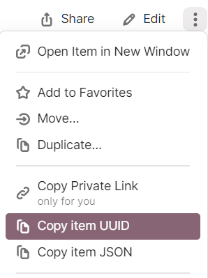

# 1Password Receiver from Server

To use this package you need to have a .env File with the following content:

```dotenv
OP_CONNECT_HOST=IP_OF_HOST(http...)
OP_CONNECT_TOKEN=YOUR_TOKEN
OP_VAULT=YOUR_VAULT
```

Besides the .env file you'll also need toml-file with the uids you'll want to receive from 1PW.

Example settings file

```toml
[api]
openai_api_key = 'REPLACE_WITH_UUID'
google_api_key = 'REPLACE_WITH_UUID'
anthropic_api_key = 'REPLACE_WITH_UUID'
github_personal_access_token = 'REPLACE_WITH_UUID'
```

You'll finde the 1Password UUID in 1Password at each item. Just click on the 3dot menu.  



## Other ways

If you don't want to create a `settings.toml` you can put the UUIDs also into the .env file. In your code you than just import the OnePWItem like so

```python
import os
from dotenen import load_dotenv
from onepw_receiver.onepw_item import OnePWItem

load_dotenv()

openai_api_key = OnePWItem(item=os.environ['OPENAI_API_KEY"]).value

```


## Example

```python
from pathlib import Path  
from dotenv import load_dotenv
from onepw_receiver.usersettings import UserSettings

# set path to the toml file and .env file
CODING_BASICS_PATH = Path("/Path/to/folder/with/settings")  
CODING_SETTINGS = CODING_BASICS_PATH / "settings" / "settings.toml"  

# load Environemtn Variables from the .env file
load_dotenv(CODING_BASICS_PATH / ".env")

# receive the password from 1Password
openai_api_key = (  
    UserSettings(str(CODING_SETTINGS)).get_onepw_item("openai_api_key", "api").value
)
```

2. Example

```python
from dotenv import load_dotenv
from onepw_receiver.usersettings import UserSettings

# load Environemtn Variables from the .env file
load_dotenv(".env")

settings = UserSettings(str('/path/to/settings.toml'))

pinterest_refresh_token = (
    settings.get_onepw_item("pinterest_api_credentials", "api", field_name="credential")
    .value
)

pinterest_app_secret = (
    settings.get_onepw_item("pinterest_api_credentials", "api", field_name="app_secret")
    .value
)

pinterest_app_id = (
    settings.get_onepw_item("pinterest_api_credentials", "api", field_name="app_id")
    .value
)
```
